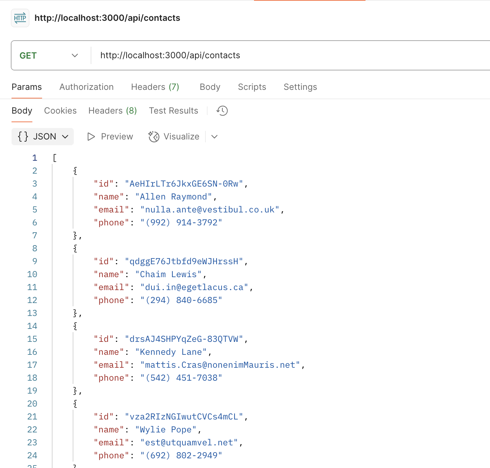

contactsRouter.get("/", getAllContacts);

contactsRouter.get("/:id", getOneContact);

contactsRouter.post("/", validateBody(contactSchema), createContact);

contactsRouter.put("/:id", validateBody(updateContactSchema), updateContact);

contactsRouter.delete("/:id", deleteContact);

