TASK 9:

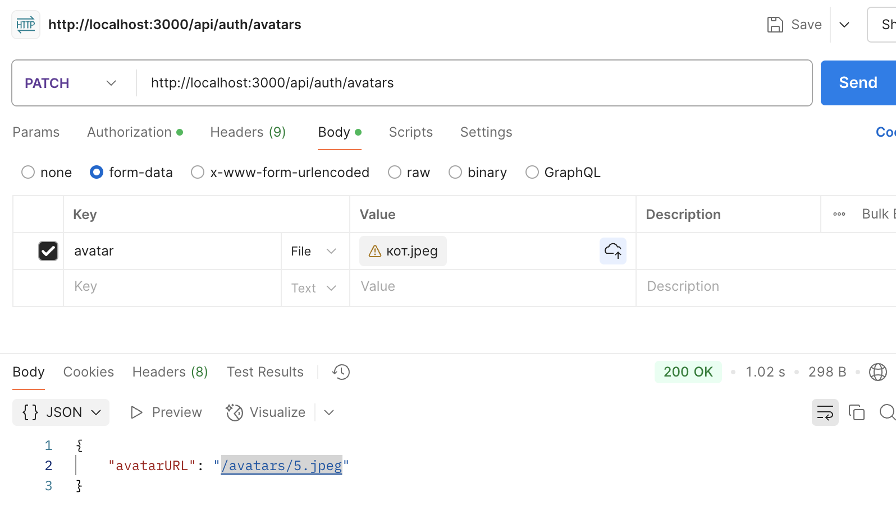

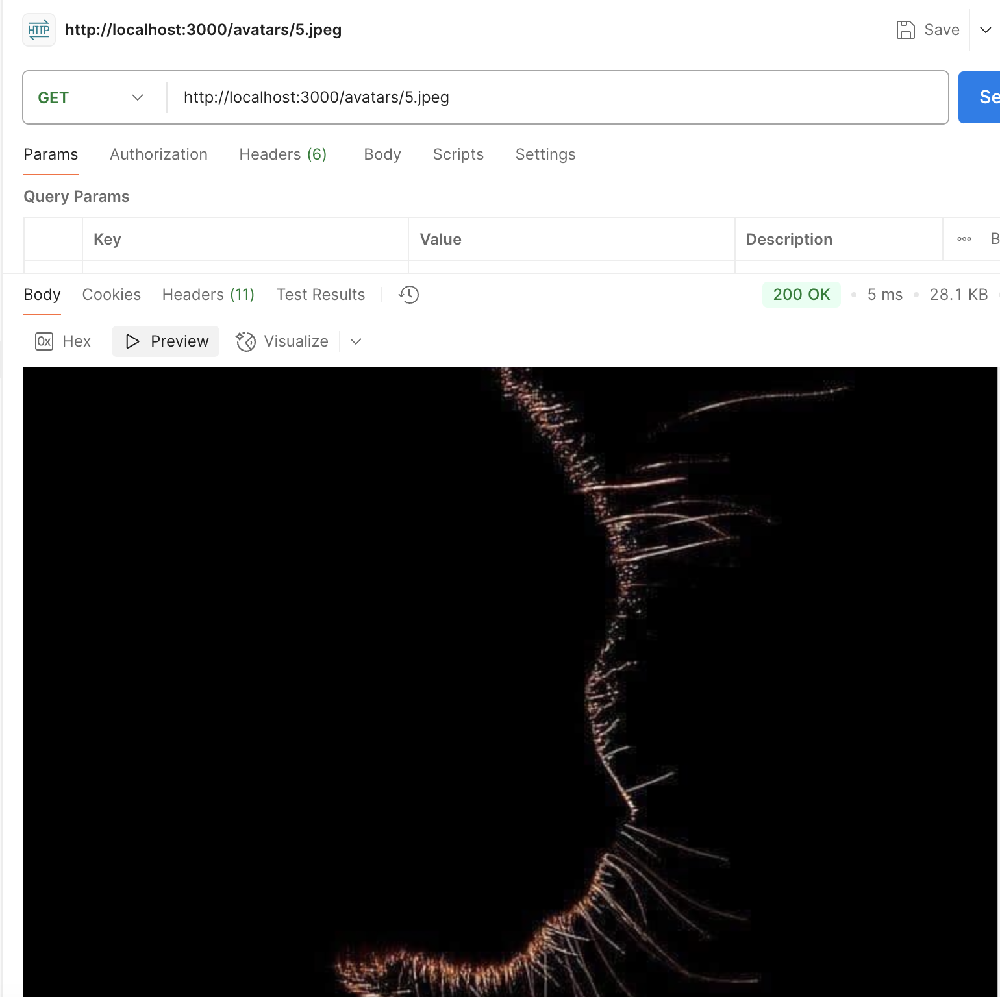

TASK 7:

userRouter.post("/register", validateBody(registerSchema), register);

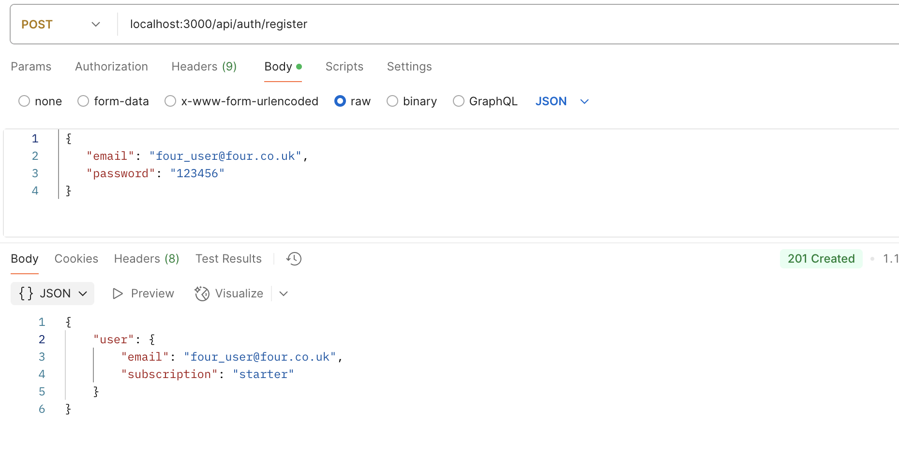

userRouter.post("/login", validateBody(registerSchema), login);

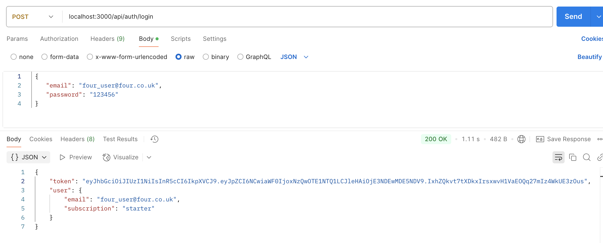

contactsRouter.get("/", authMiddleware, getAllContacts); // owner 3

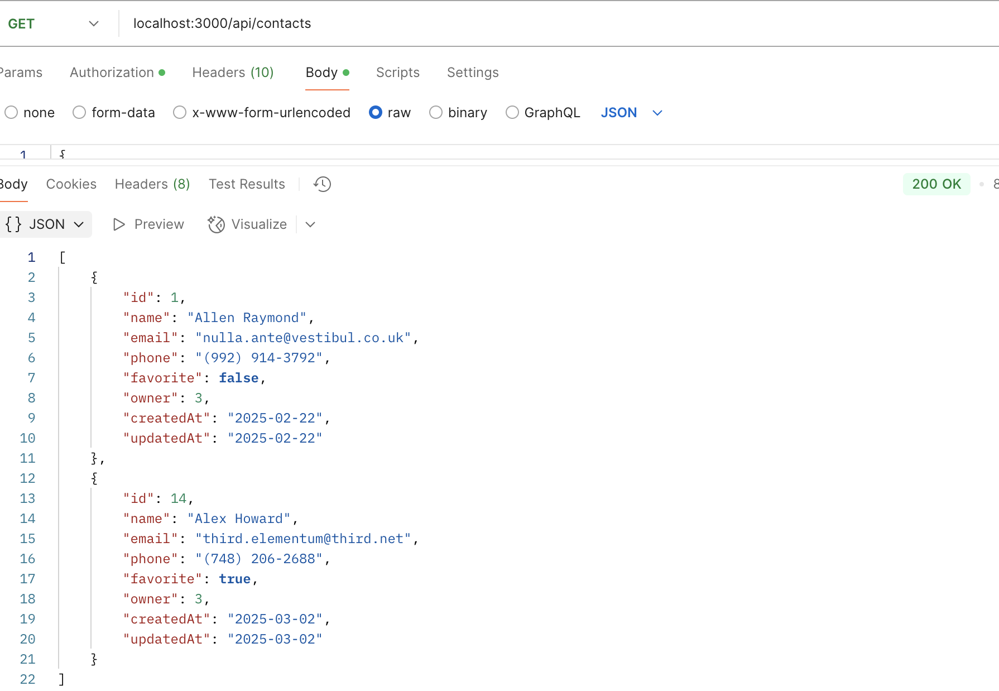

userRouter.get("/current", authMiddleware, current);

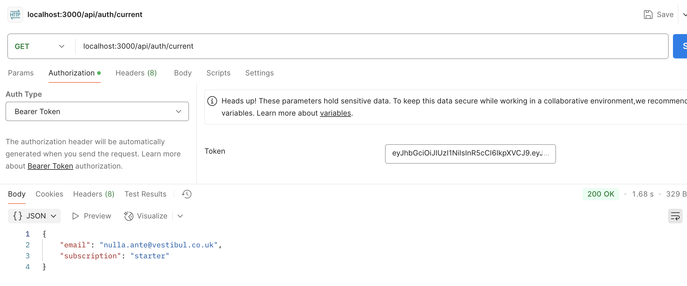

userRouter.post("/logout", authMiddleware, logout);

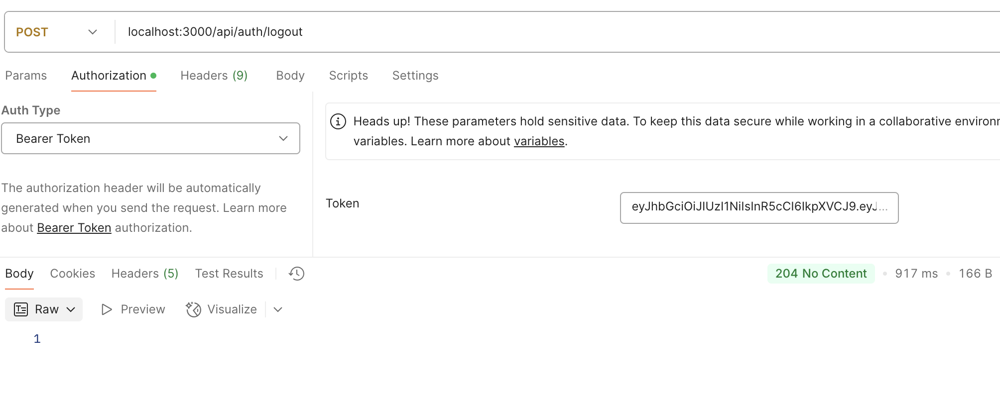

contactsRouter.get("/", getAllContacts);

contactsRouter.get("/:id", getOneContact);

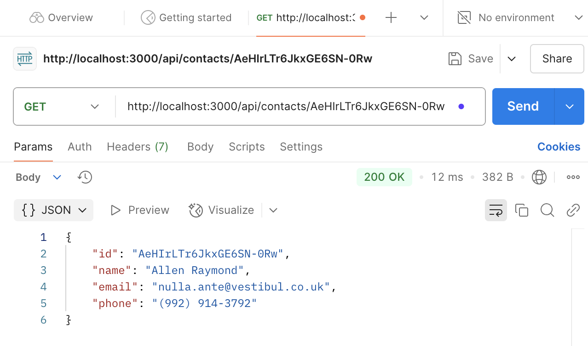

contactsRouter.post("/", validateBody(contactSchema), createContact);

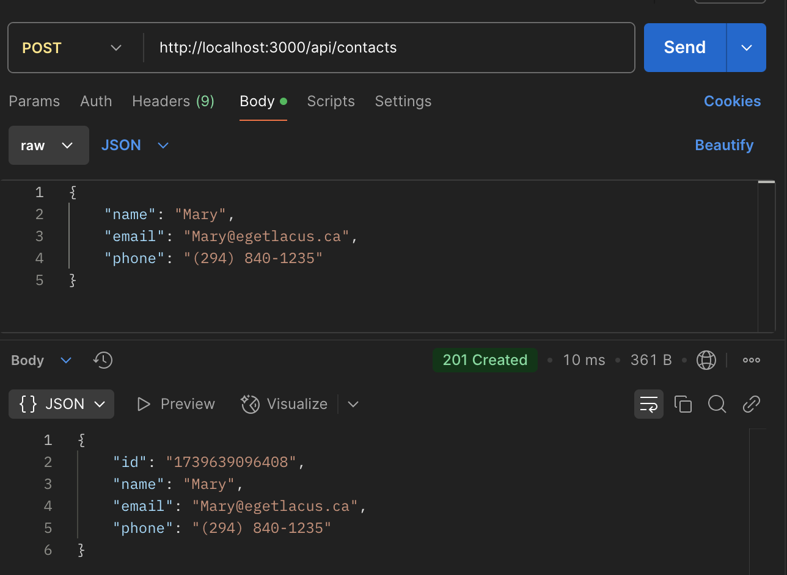

contactsRouter.put("/:id", validateBody(updateContactSchema), updateContact);

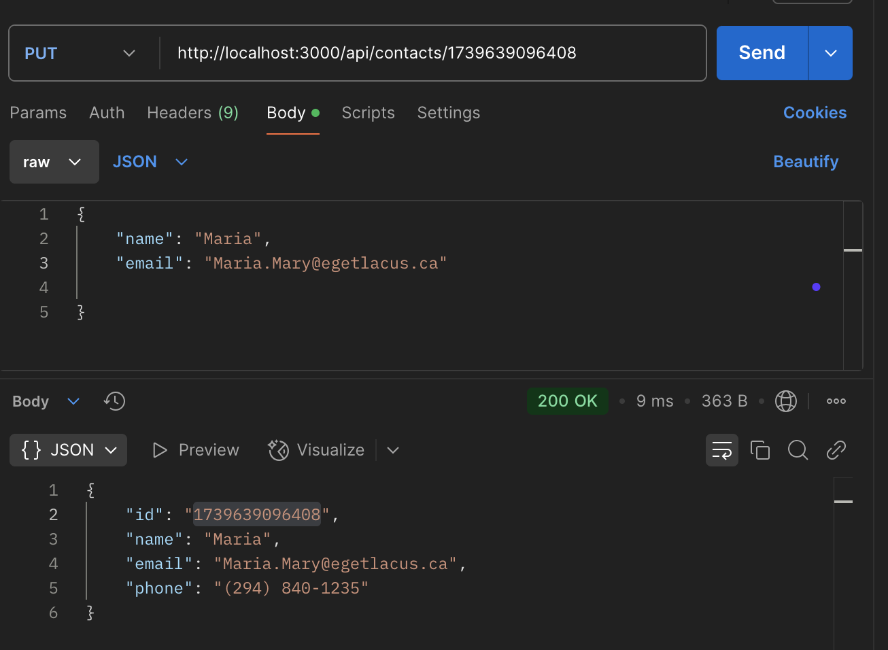

contactsRouter.delete("/:id", deleteContact);

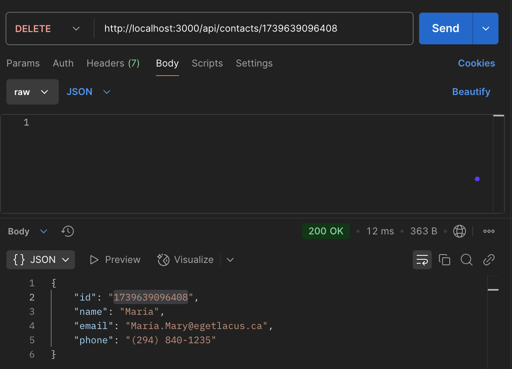

contactsRouter.put("/:id/favorite", validateBody(updateStatusSchema), updateFavorite);

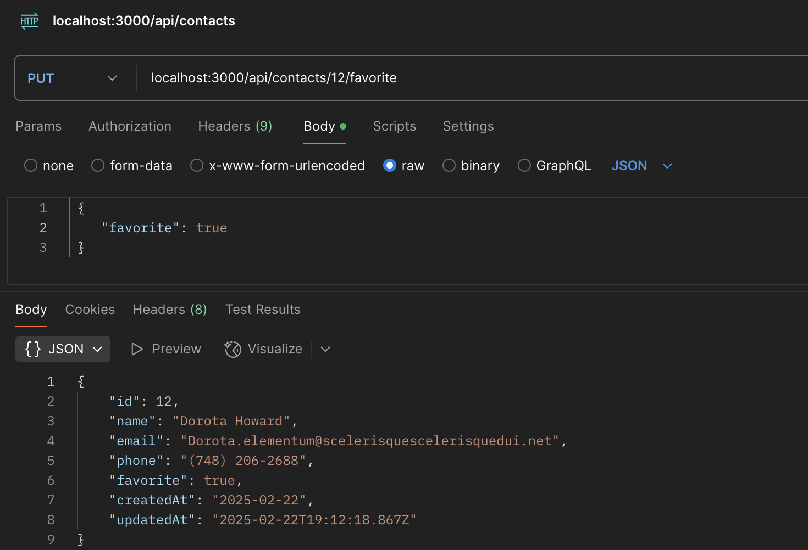

DataBase:

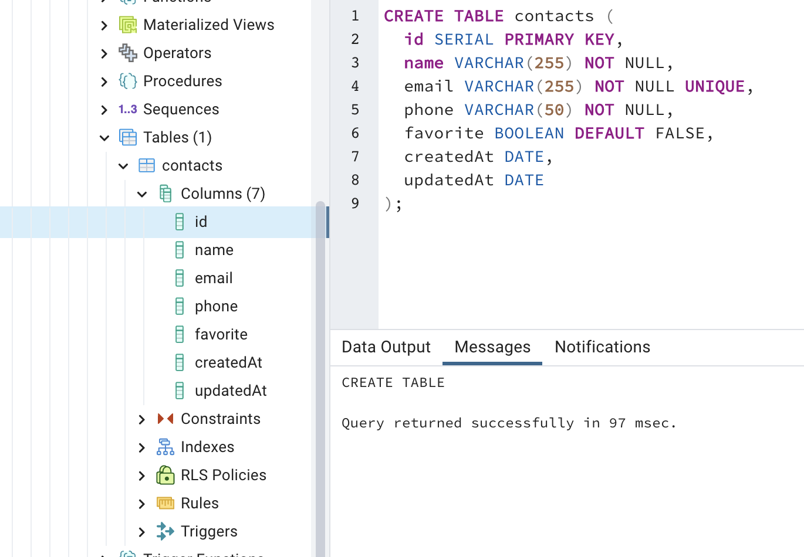